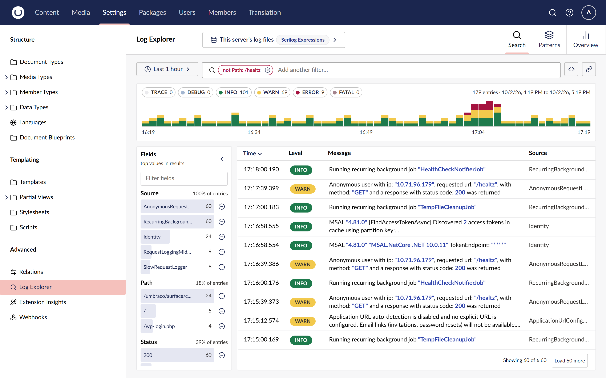
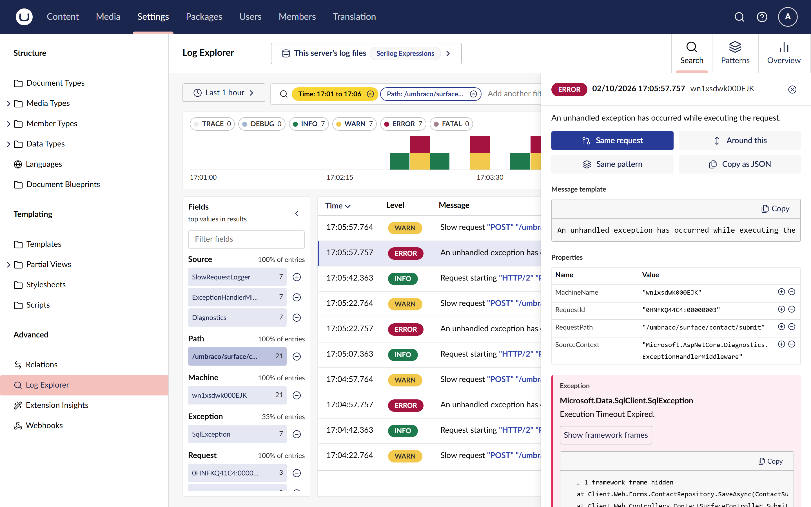
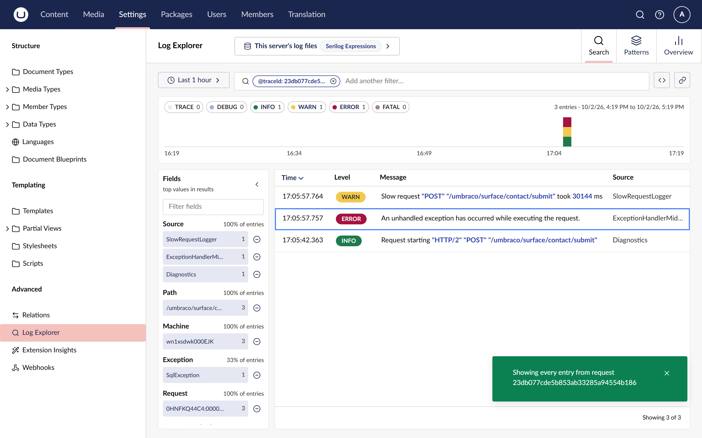
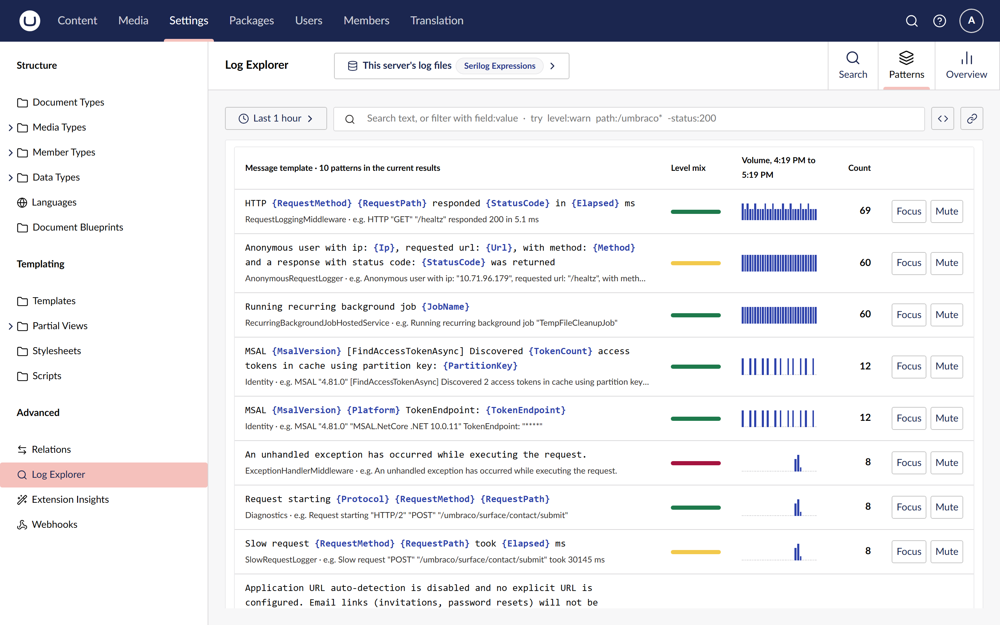
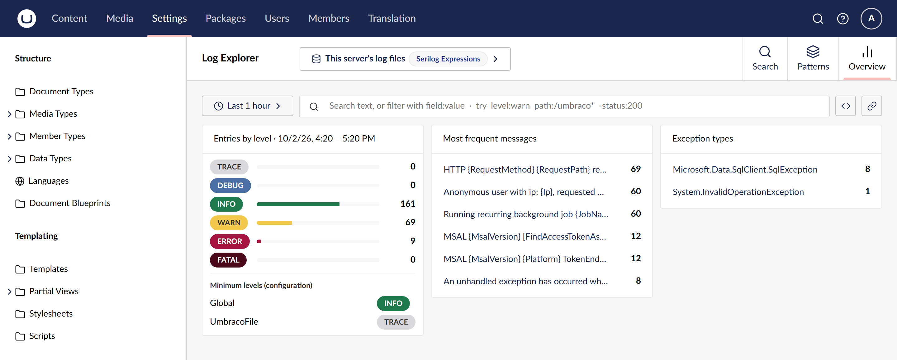
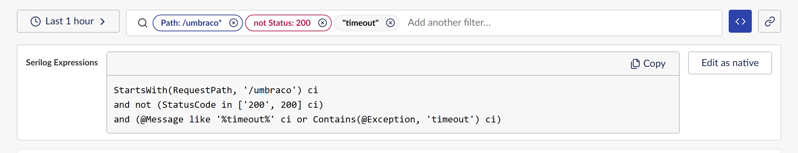

# Umbraco Log Explorer

A rich log explorer for the Umbraco backoffice and a drop-in replacement for the built-in Log
Viewer. Install the package and it takes the Log Viewer's place under Settings, reading the same
log files with no configuration. You get far more on top: click values, fields, histogram bars
and patterns to build filters without knowing a query language, follow a request in one click,
and see the query it runs whenever you want it.

[](https://www.nuget.org/packages/Umbraco.Community.LogExplorer)
[](https://github.com/worm-brain/Umbraco.LogExplorer/actions/workflows/ci.yml)
[](LICENSE)



## Contents

- [Features](#features)
- [A quick tour](#a-quick-tour)
- [Install](#install)
- [Quick start](#quick-start)
- [Configure](#configure)
- [Compatibility](#compatibility)
- [Documentation](#documentation)
- [Contributing, security and licence](#contributing-security-and-licence)

## Features

**Find entries without a query language**

- **A forgiving search box.** Type any words to find entries whose message or exception contains
  them. To filter on a field, type it with a value: `path:/umbraco*` keeps one path, `-status:200`
  hides a status code, and each becomes a chip you can edit or remove. If the explorer cannot read
  what you typed, for example a quote left open, it searches for it as plain text and tells you why.
  [Search and filter](docs/how-to/search-and-filter.md)
- **Filter chips.** Include or exclude a value; two chips on the same field match either value,
  chips on different fields must all match. Click a chip to change its operator or value.
- **A fields panel.** The top values of the fields you care about (source, request path, status
  code, machine, exception type), then every other field the entries carry, each with how often it
  appears. Click a value to filter on it, or choose its minus to exclude it. The panel resizes and
  collapses, and remembers its state.
- **Level toggles.** TRACE to FATAL, each with its count, are the level filter. They keep showing
  how many entries a hidden level holds.

**See what happened when**

- **Time ranges** from the last 15 minutes to the last 30 days, or a custom range with the time
  zone shown. [Narrow the time range](docs/how-to/narrow-the-time-range.md)
- **A histogram** stacked by level. Click a bar to zoom to five minutes around it, or drag across
  bars to zoom to any range.

**Dig into one entry**

- **An entry drawer** beside the results, which stay usable. It shows the rendered message, the
  message template, every property as a typed tree, and the exception with framework frames
  folded away. Click a value in the message, or choose a property's include or exclude button, to
  filter on it.
  [Inspect an entry](docs/how-to/inspect-an-entry.md)
- **Same request** shows every entry from the request that logged this one, in one click.
- **Around this** shows the 7 entries either side of this one, ignoring your filters.
  [Follow a request](docs/how-to/follow-a-request.md)
- **Same pattern** filters on the entry's message template, and **Copy as JSON** copies the entry.

**Spot trends**

- **Patterns** groups entries by message template, busiest first, with a level mix, a volume
  sparkline and a count. Focus on a pattern or mute it in one click.
  [Find the most frequent messages](docs/how-to/find-frequent-messages.md)
- **Overview** summarises the time range: entries by level, the minimum level each log sink is
  configured to write, the most frequent messages and the exception types.
  [Summarise a time range](docs/how-to/summarise-a-time-range.md)

**Learn the query language as you go**

- **Show generated query** reveals the Serilog expression for your filters, one clause per line.
  It is the dialect the core Log Viewer accepts, so you can paste it there too.
- **Native mode** lets you edit that expression directly, checked as you type, with the error
  position marked. [Use the query language](docs/how-to/use-the-query-language.md)

**Share and work quickly**

- **Copy link to this view.** The whole view (time range, zoom, filters, levels, sort, tab) lives in
  the URL, so a link or a reload shows exactly what you saw. [Share a view](docs/how-to/share-a-view.md)
- **Keyboard shortcuts**: `/` to search, `j` and `k` to move through results, Enter to open one,
  Escape to close. [All shortcuts](docs/reference/keyboard-shortcuts.md)
- **Accessible and responsive.** Every control works from the keyboard and is labelled for screen
  readers, and the layout adapts to narrow workspaces.

**Built for real log files**

- Reads every machine's files in the log folder, including rolled `_001` files, merged by time,
  so load-balanced sites on shared storage show one timeline.
- Reads the newest entries first, backwards from the end of each file, so a busy week of logs
  opens quickly instead of hitting the core viewer's 1 GB limit.
- Counts for the histogram, fields and patterns stop at a scan budget on very large ranges, are
  marked **Approximate**, and the histogram shows which part of the range was not read.
  [How log files are read](docs/explanation/reading-log-files.md)
- Sits under **Settings > Advanced** and hides the core Log Viewer by default; one setting brings
  it back.

### Coming next

- Application Insights and Seq sources, switchable from the source picker, with features each
  source cannot run disabled and explained.
- Per-source user groups and sensitive sources, with an audit entry when one is queried.
- Masking of secrets and e-mail addresses in every response.
- Saved views, personal and shared, and a one-time import of the core Log Viewer's saved searches.
- Export to CSV and JSON Lines.
- Links from content, media and user ids in log entries to their backoffice editors.

## A quick tour

**Open an entry.** The drawer shows the message, its typed properties and the exception, with
**Same request** and **Around this** one click away.



**Follow the request.** Same request swaps every filter for the request's trace id and shows its
whole story: the request starting, the exception and the slow-request warning.



**Find the noisy and the broken.** Patterns groups the time range by message template, with a
level mix and a sparkline for each.



**Summarise the hour.** Overview shows the level counts, the configured minimum levels, the most
frequent messages and the exception types.



**See the query.** Every filter compiles to the core Log Viewer's own Serilog Expressions, so the
tool teaches the syntax as you use it.



## Install

The package comes in one line per Umbraco major: `17.x` versions for Umbraco 17 and `18.x` versions
for Umbraco 18. Pick the line that matches your site:

```sh
# Umbraco 17
dotnet add package Umbraco.Community.LogExplorer --version 17.0.0

# Umbraco 18
dotnet add package Umbraco.Community.LogExplorer --version 18.0.0
```

Use the newest version of your line listed on [NuGet](https://www.nuget.org/packages/Umbraco.Community.LogExplorer).
Without `--version`, `dotnet add package` picks the newest version overall, which is the `18.x`
line.

## Quick start

1. Install the package and run the site.
2. Sign in as a user with access to the Settings section and open
   **Settings > Advanced > Log Explorer**.
3. Click a histogram bar to zoom in, open an entry, and choose **Same request** to see everything
   that request logged.

No configuration is needed: the package reads the site's own `umbraco/Logs` files. The
[first-error tutorial](docs/tutorials/find-your-first-error.md) walks through it with screenshots.

## Configure

Everything is optional and lives under `LogExplorer` in `appsettings.json`. The settings you are
most likely to change:

```json
{
  "LogExplorer": {
    "HideCoreLogViewer": true,
    "DefaultTimeRange": "1h",
    "PinnedFacets": ["SourceContext", "RequestPath", "StatusCode", "MachineName", "@exception.type"],
    "Files": { "ScanBudgetMegabytes": 256 }
  }
}
```

The [configuration reference](docs/reference/configuration.md) lists every setting and its default.

## Compatibility

| Umbraco | Package line | .NET    |
| ------- | ------------ | ------- |
| 17.x    | `17.*`       | 10      |
| 18.x    | `18.*`       | 10      |

Umbraco 16 and earlier are not supported.

## Documentation

The full documentation is in [`docs/`](docs/index.md):

- **Tutorial:** [find your first error](docs/tutorials/find-your-first-error.md)
- **How-to guides:** one page per feature, with screenshots, from
  [searching and filtering](docs/how-to/search-and-filter.md) to
  [sharing a view](docs/how-to/share-a-view.md)
- **Reference:** [configuration](docs/reference/configuration.md),
  [search syntax](docs/reference/search-syntax.md), [fields and levels](docs/reference/fields.md),
  [keyboard shortcuts](docs/reference/keyboard-shortcuts.md) and the
  [Management API](docs/reference/api.md)
- **Explanation:** [the provider model](docs/explanation/provider-model.md),
  [how log files are read](docs/explanation/reading-log-files.md) and the
  [security model](docs/explanation/security.md)

## Contributing, security and licence

- [CONTRIBUTING.md](CONTRIBUTING.md) explains how to build both Umbraco majors and run the tests.
- [SECURITY.md](SECURITY.md) explains how to report a vulnerability privately.
- [CHANGELOG.md](CHANGELOG.md) lists every user-visible change.
- Licensed under the [MIT licence](LICENSE).
