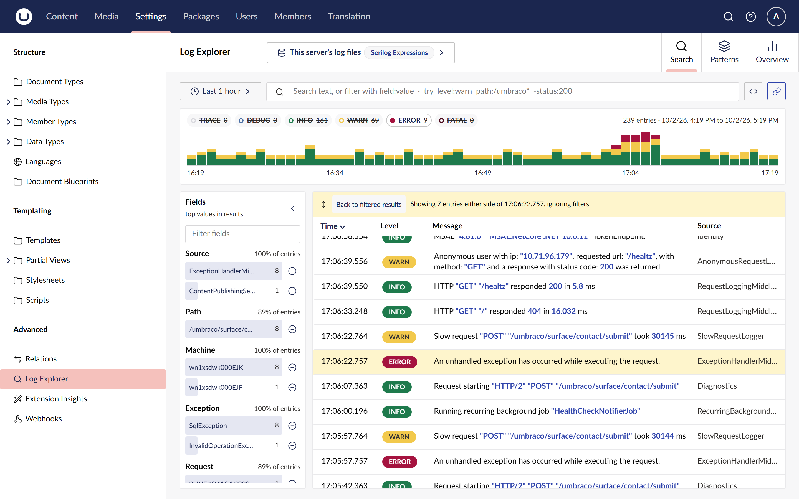

# Follow a request

An error rarely tells the whole story on its own. Two buttons in the entry drawer show what
happened with it: **Same request** follows the request it belongs to, and **Around this** shows
what the site logged just before and after it.

## See every entry from one request

1. Open an entry (see [Inspect an entry](inspect-an-entry.md)).
2. Choose **Same request**.

The explorer replaces every filter, the level filter and any zoom with one chip on the entry's
request, and tells you so in a notification:

It uses the first of these fields that has a value on the entry: the trace id, then `RequestId`,
then `HttpRequestId`. You can change that order with `CorrelationFields` (see the
[configuration reference](../reference/configuration.md)).

**Same request** is disabled, with a tooltip saying why, when the entry has none of those fields;
for example, a line logged by a background job outside any request.

## See what happened around an entry

1. Open an entry.
2. Choose **Around this**.

The results show the entry and the 7 entries either side of it in time, from every machine and
ignoring your filters. The entry is highlighted, and a banner says what you are looking at:

Choose **Back to filtered results** in the banner to return to your filtered list. Around this is
kept in the URL, so a reload or a shared link shows the same entries.

## Related

- [Share a view](share-a-view.md) to send the request to a colleague.
- [Find the most frequent messages](find-frequent-messages.md) to see whether the error is a
  one-off.
