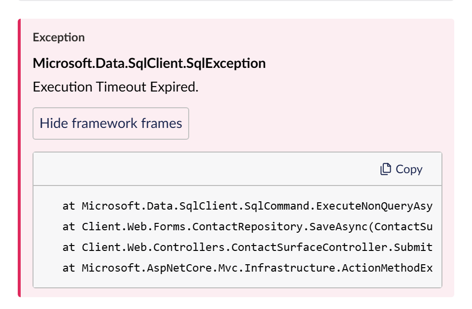

# Inspect an entry

Click a row in the results (or move to it with `j` and `k` and press Enter) to open the entry
drawer. It slides over the right of the workspace while the results stay usable on the left, so
you can click another row to switch entries.

## What the drawer shows

From the top:

1. **The header:** the level, the local date and time to the millisecond, and the machine that
   logged it.
2. **The rendered message.** Values that came from message properties are highlighted; click one
   to filter on that field and value.
3. **Actions:** Same request, Around this, Same pattern and Copy as JSON (below).
4. **The message template**, with a copy button. This is the text before values were filled in,
   which is what Patterns groups by.
5. **Properties:** every property of the entry as a typed tree, sorted by name. Objects and arrays
   expand. Each property has an include (+) and exclude (-) button; nested values filter by their
   path, such as `Cart.Total` or `Tags[]`.
6. **The exception**, when there is one: its type, message and stack trace.

## Read a stack trace

Framework frames (`System.*`, `Microsoft.*` and `Umbraco.Cms.*`) are folded away so your own code
stands out; the trace says how many are hidden. Choose **Show framework frames** to see them all.

The copy button copies the full stack trace.

## Actions

- **Same request** shows every entry from the same request. See
  [Follow a request](follow-a-request.md).
- **Around this** shows the 7 entries either side of this one, ignoring filters. See
  [Follow a request](follow-a-request.md#see-what-happened-around-an-entry).
- **Same pattern** adds a filter on this entry's message template, so you see every occurrence of
  the same message.
- **Copy as JSON** copies the whole entry, for a ticket or a chat message.

## Close the drawer

Press **Escape** or choose the close button. Focus returns to the row you opened.

## Related

- [Search and filter](search-and-filter.md)
- [Fields and levels](../reference/fields.md) for the field names you see in the drawer.
