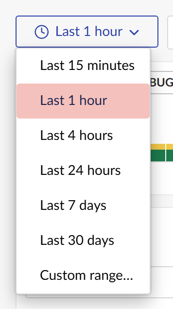

# Narrow the time range

The explorer always searches one time range, shown on the button at the left of the query bar.
Pick a preset, set a custom range, or zoom in with the histogram.

## Pick a preset

Click the time range button and choose a range.

The presets are relative: **Last 1 hour** always means the hour before now, including in a shared
link or after a reload. The explorer opens on **Last 1 hour** unless `DefaultTimeRange` says
otherwise (see the [configuration reference](../reference/configuration.md)).

## Set a custom range

Choose **Custom range...** and enter a start and end date and time. The time zone the range uses
is shown next to it. A custom range is absolute: a link to it shows the same minutes tomorrow.

## Zoom with the histogram

The histogram shows how many entries fall in each slice of the range, stacked by level. Hover a
bar to see its counts.

- **Click a bar** to zoom to a five-minute window around it.
- **Drag across bars** to zoom to exactly the range you select.

Either way a yellow **Time** chip appears in the search box, and the histogram redraws for the
zoomed range with finer bars:

To zoom back out, remove the **Time** chip, or choose a new time range. Clicking a bar while you
are already zoomed in tells you to clear the chip first.

The keyboard works too: Tab to the bars, move between them with the arrow keys, Home and End, and
press Enter or Space to zoom.

## When the histogram is approximate

On a very large range the files source stops counting at its scan budget and works from the newest
entries back. The histogram then shows an **Approximate** tag, its summary says which time the
counts start from, and the part of the range it did not read is hatched, so a stretch it never
read is not mistaken for a quiet one. See
[how log files are read](../explanation/reading-log-files.md).

## Related

- [Search and filter](search-and-filter.md)
- [Share a view](share-a-view.md): relative ranges and zooms are kept in the link.
