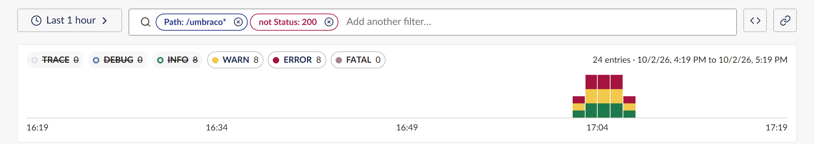
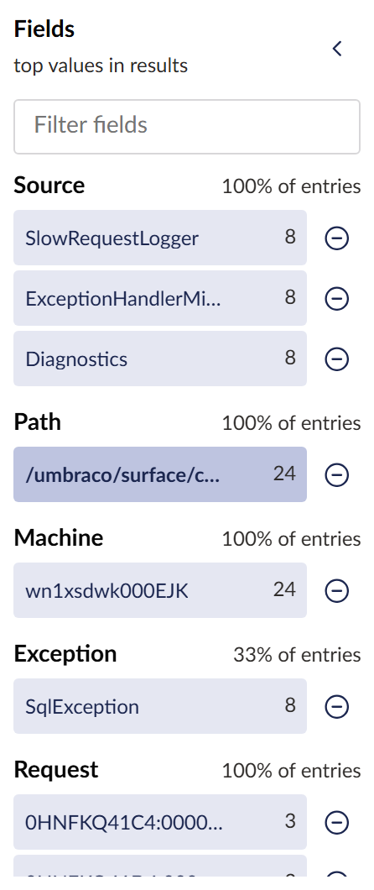

# Search and filter

Every filter in the Log Explorer is a chip in the search box, or a level toggle on the histogram.
You can type filters, or click values and let the explorer build them.

## Type a search

Click the search box (or press `/`), type, and press **Enter**. The explorer turns what it
recognises into chips and searches the rest as text.

The screenshot came from typing `level:warn path:/umbraco* -status:200`:

- `path:/umbraco*` became an include chip, **Path: /umbraco\***;
- `-status:200` became an exclude chip, **not Status: 200**;
- `level:warn` made no chip: it set the level toggles to WARN and above.

Some things to try:

| Type | To find |
| --- | --- |
| `timeout` | entries whose message (or exception) contains "timeout" |
| `"connection refused"` | that exact phrase |
| `RequestPath:/umbraco/surface/contact/submit` | one field equal to one value |
| `-SourceContext:Umbraco.Cms.Core.Sync*` | everything except entries from one namespace |
| `Elapsed>1000` | slow requests |
| `has:ContentId` | entries that carry a field at all |
| `level:error` | ERROR and FATAL |

The [search syntax reference](../reference/search-syntax.md) lists every form and alias.

If the explorer cannot read your input, for example a quote left open, it searches the whole
input as plain text and tells you why in a notification.

## Work with chips

- **Remove** a chip with its cross, or press **Backspace** in the empty search box to remove the
  last one.
- **Edit** a chip by clicking it: change its operator (equals, starts with, contains, and so on)
  or its value, or turn it into an exclude.
- **Combine** chips: two include chips on the same field match either value (`Path: /a` or
  `Path: /b`); chips on different fields must all match.
- Press **Escape** to clear what you have typed but not yet turned into chips.

When there are many chips they wrap onto up to three rows, so none is cut off.

## Click values in the fields panel

The fields panel beside the results shows the top values of the pinned fields (source, request
path, status code, machine and exception type by default), then every other field the matching
entries carry. Each field says what share of entries has it; each value shows its count and a bar
relative to the top value.

- Click a value to filter on it. Click it again to remove that filter. Selected values are
  highlighted.
- Choose the minus beside a value to exclude it.
- Type in **Filter fields** to find a field by name.
- Drag the gap between the panel and the results to resize it. From the keyboard, focus the
  divider and use the arrow keys. Double-click the divider to reset the width.
- Choose the arrow button to collapse the panel to a thin strip.

The explorer remembers the panel's width and whether it is collapsed, in your browser.

An **Approximate** tag on the panel means the counts cover only the most recent entries, because
the range was too large to read in full. See
[how log files are read](../explanation/reading-log-files.md).

To change which fields are pinned, set `PinnedFacets` (see the
[configuration reference](../reference/configuration.md)).

## Show or hide levels

The level toggles above the histogram are the level filter. Click a level to hide it; click it
again to show it. A hidden level is struck through but keeps its count, so you can see what you
are hiding.

Typing `level:warn` sets the toggles to WARN and above; `level=warn` sets exactly WARN.

## Related

- [Narrow the time range](narrow-the-time-range.md)
- [Use the query language](use-the-query-language.md) to see the query your chips build.
