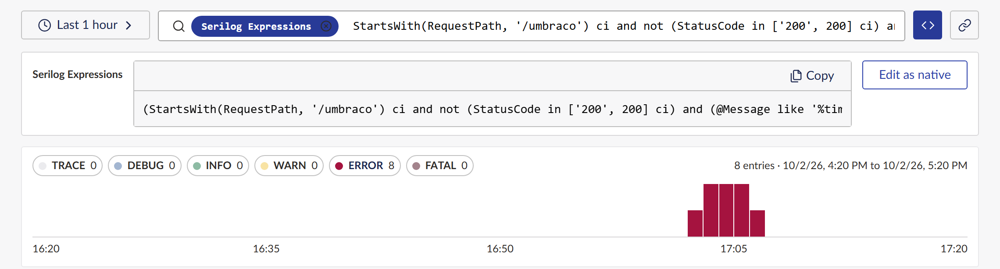

# Use the query language

Every filter you build by clicking is compiled to the source's own query language. For the log
files source that is **Serilog Expressions**, the dialect the core Log Viewer accepts. You can look
at the compiled query, copy it, or write one yourself.

## Show the generated query

Choose the **Show generated query** button (`</>`) at the right of the query bar. A panel opens
under it with the query, one clause per line:

- **Copy** copies the query, for example to paste into the core Log Viewer.
- With no filters, the panel says every entry in the time range matches.
- A filter the source cannot run is shown struck through with "Not supported by {source}" and left
  out of the search; it is never silently dropped.
- A filter the source runs but cannot write in its language (on the files source, an exception
  type) stays active and is listed under the query as "Not shown in {language}".

The panel stays open as you change filters, and is kept in the link when you
[share a view](share-a-view.md).

## Write a native query

1. In the show-query panel, choose **Edit as native**.
2. The query moves into the search box, which is now labelled with the language:

   

3. Edit it. It is checked as you type; an invalid query is marked with the error and where it is.
4. Press Enter to run it. Any chips you still have are combined with it.

To go back to the simple search box, choose the language tag's remove button.

Some Serilog Expressions to start from:

| Expression | Finds |
| --- | --- |
| `@Message like '%timeout%' ci` | messages containing "timeout", any case |
| `StartsWith(RequestPath, '/umbraco/api')` | requests under one path |
| `Has(Duration) and Duration > 1000` | entries with a slow `Duration` |
| `@Level = 'Error' or @Level = 'Fatal'` | errors and fatal entries |
| `not StartsWith(SourceContext, 'Umbraco.Cms.Core.Sync')` | everything but one namespace |

## Turn native mode off for a source

Set `"AllowNativeQuery": false` on a source to hide native mode for it. **Show generated query**
stays available. See the [configuration reference](../reference/configuration.md#sources).

## Related

- [Search syntax](../reference/search-syntax.md): the simple syntax the search box reads.
