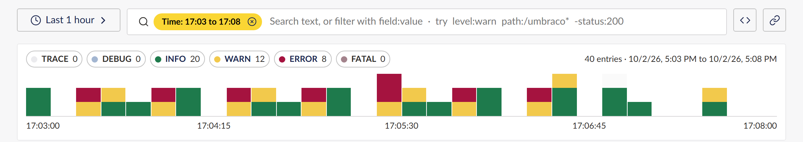

# Find your first error in five minutes

In this tutorial you open the Log Explorer, spot a burst of errors on the histogram, open one of
them and see every entry from the request that caused it. You need no query syntax.

You need:

- an Umbraco 17 or 18 site with the package installed (see the [README](../../README.md#install));
- a backoffice user with access to the **Settings** section;
- a site that has logged some errors. If yours has none, the steps still work on any entry.

The screenshots come from a site whose contact form timed out against its database for a few
minutes.

## 1. Open the explorer

Go to **Settings**, and under **Advanced** choose **Log Explorer**. It opens on the **Search** view
for the last hour.

Three things are on screen:

- the **histogram** at the top, one bar per minute, stacked by level, with a toggle and a count for
  each level above it;
- the **fields panel** on the left, with the most common values of useful fields;
- the **results** on the right, newest first.

## 2. Zoom in on the spike

The red segments in the histogram are `ERROR` entries. Click the bar where they cluster. The
histogram zooms to the five minutes around it, and a yellow **Time** chip appears in the search box.

To hide everything but the errors, you could click the other level toggles off. You do not need to
here: the errors already stand out.

## 3. Open an error

To focus on the failing page, click `/umbraco/surface/contact/submit` under **Path** in the fields
panel; it becomes a **Path** chip next to the **Time** chip. Then click an `ERROR` row in the
results. The entry drawer opens on the right, while the results stay usable on the left.

The drawer shows the message, the message template, every property the entry carries and the
exception. This one is a `Microsoft.Data.SqlClient.SqlException`: an execution timeout.

## 4. See the whole request

Choose **Same request**. The explorer replaces your filters with one chip for the request's trace
id and shows every entry that request logged.

The story is now clear: a `POST` to `/umbraco/surface/contact/submit` started, the database call
timed out, and the request took 30 seconds.

## What you learned

- The histogram and its level toggles are the quickest way to find trouble in time.
- Clicking a bar zooms in; the **Time** chip's remove button zooms back out.
- The entry drawer's **Same request** button shows a request's whole story in one click.

## Next steps

- [Search and filter](../how-to/search-and-filter.md) to narrow results with chips and the fields
  panel.
- [Find the most frequent messages](../how-to/find-frequent-messages.md) to see which errors happen
  most.
- [Share a view](../how-to/share-a-view.md) to send a colleague exactly what you found.
